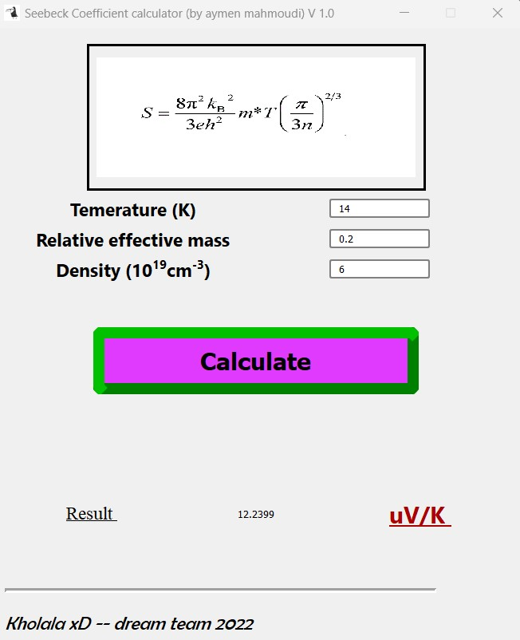

# Seebeck coefficient calculator


## Description
This project allows to calculate the Seebeck coefficient via the formula below using the density, the temperature and the effective mass.
<br>
<br>
$$\frac{8\pi^{2}k_{B}^{2}}{3eh^{2}}mT\left[ \frac{\pi}{3n} \right]^{\frac{3}{2}}$$


## Usage
You just have to insert the density, the temperature and the effective mass values and press on the calculate buton.




## Installation
To use the app, you can download and directly execute the file mass.exe (just for Windows X64). Otherwise, you can run the main.py script which is available within the necessary resources. I recommend to setup a python 3.8 virtual environment and adding the required libraries using the following command after cloning the rep (you can just download the rep in case you don't use git):
```console
pip install -r requirements.txt
```

## Roadmap
 <ul>
  <li>Avoid the crash of the app in case of empty value</li>
  <li>Transform the project on a desktop application</li>
</ul> 

## Support and Contributing
Let me know if you have any suggestions/ideas to enhance those scripts or add further settings. Your suggestions are warmly welcomed.
<br>
In case of a problem, It is strongly recommended to post an issue. For a more confidential demand, don't hesitate to email me.

## Acknowledgment
I thank Geoffroy Kremer for testing and verifying the formula.  


